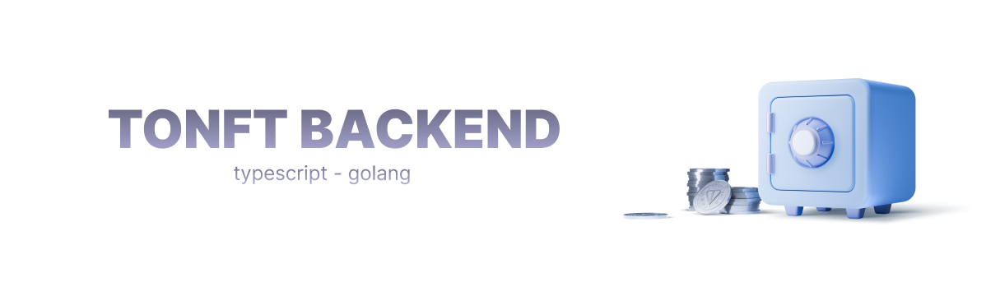

# TONFT | NFT Bazaar Backend
Welcome to the TONFT | NFT Bazaar backend GitHub repository! This repository contains the backend code for the first NFT bazaar on TON.

## Prerequisites
Before running the backend, make sure to have the following installed:

- Node.js
- Yarn package manager
- PostgreSQL
- Docker

## Getting Started
To run the backend, follow these steps:

1. Clone this repository `git clone git@github.com:tonft-app/backend.git`;
1. In the project directory, create a `.env` file with the necessary environment variables. See `.env.example` for an example;
1. Install dependencies by running `yarn install`;
1. Start the PostgreSQL container by running `yarn run start:postgres`;
1. Run the server by running `yarn run start`.

The server should now be up and running at http://localhost:3000.

## Project Structure
The project consists of three parts:

### Main API Server
Server interacts with the front-end and blockchain.

### Highload Wallet Server
This server sends at most 250 transactions at the same time.

### Withdrawal Harvester
Server performs referral bonus distribution.

### TONFT Alert Bot
Telegram bot that notifies users about new offers and sales of NFTs.

Backend is written in two languages: `TypeScript` and `Go`.

## Contribution
Pull requests and suggestions are welcome on [@qpwedev](https://t.me/qpwedev) telegram.

Thank you for using TONFT | NFT Bazaar!